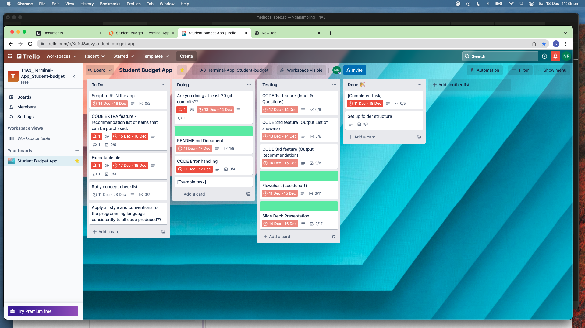

- Your README.md should have a separate heading for each documentation requirement and answers organised under the appropriate headings.
- Provide full attribution to referenced sources (where applicable).

## Link to source control repository

[NgaNaNa] (https://github.com/NgaNaNa/student-budget-terminal-app)

## Software Development Plan for the Student Budget Terminal application

### Statement of purpose and scope for your application:

- What the application does:
    - This terminal application is called Student Budgeting App. It is designed to support students in managing their finances in a quick and handy format. Simple to understand and simple to use. It will hopefully help students gain some freedom when they have control over their weekly expenditures.
    How it works: The app will present users with a series of questions to gain data. Using the data, the app will perform mathematical calculations and generate outputs that are relevant to the user. Inside the app, there will be a variety of preset templates of financial recommendations. Based on the outcome of the mathematical calculations, the app will be able to evaluate which recommendations are suited to the user, using methods and logic in its program.

- The problem it will solve and why I am developing it:
    - I wanted to build this app to help young adults who are new to navigating their finance independently. This app will allow them to be active thinkers of where they are putting their monies, and that where they put their monies will alter their daily life. Hopefully, this app will prevent young people from falling into debt, and that living within their means is a doable thing. The app will be able to do basic math calculations, evaluate and give meaningful and helpful recommendations about their financial situation for that week. Weekly use of the app and practicing the recommendations should help keep user on track with their spending and savings.

- Identify target audience:
    - The target audience would be anyone who has either a regular income or weekly income that varies. The same user would also have weekly expenses that they are responsible for. This app would be ideal to anyone from 16 years of age and above, and has access to a computer. The internet is required only at the start for installation.
    It is targeted towards anyone who wants to spend small amount of time working out their financial situation and break down for that week. Someone who would to have a general forecast every week about how they spend their money.

- How the target audience should use the app:
    - The user would be presented with a series of questions and they need to answer it using the keyboard input. The program collects and store the data, then presents it to the user to confirm if their entry is correct. If correct, the program proceeds to the next feature where it evaluates the data and presents the user with a recommendation based on their inputs. The recommendation is a reflection and provides simple financial advise to the user.
    An extra feature, which is extra, is to present the user with a list of things they can purchase with the money they have saved. The list would be items that may be of interest to students often on a budget.

### List of features in the application.

#### Feature No. 1
- The first feature in this app will allow for data input from the user's keyboard. The program will store this data for later use. This part of the feature happens when the app starts, it will go straight to presenting the user with a series of questions as part of its flow structure. See example below:
```
What is your expected income this week?
250
```
#### Feature No. 2

- The program will regurgitate the information back to the user in a hash list format. It will then presents the user with an option to proceed with the evaluation or go back to the start and enter new information, as an option for changing the answers.
```
This week’s income is $250
This week’s total expense is $200
You would like to put away $20 of savings this week
```

#### Feature No. 3

- The program will run a basic mathematical calculation in the background using the data given and once it’s made an evaluation based on the outcome, the program will present the user with a feedback summary and recommendations. The sample of the feedback might be:
Congratulations, your budget is healthy. You may spend up to $4.29 per day comfortably, after you have covered your total expenses for the week. You may transfer $20 into your savings account.
In this feature, there will be a use of methods to perform mathematical calculations. With the return value, it will run through a series of if / elsif statements to locate its most suited feedback.
The variables will come from the inputs from the user at the start, and the variable scope shall be demonstrated within the methods.
Finally, the user will have a choice to select the following:
    - I don’t like this feedback, let’s try a different figure (The program will not save the data and will also take the user back to the start)
    - Exit the program

## Develop an outline of the user interaction and experience for the application.

- How the user will find out how to interact with / use each feature.
The user will be presented on screen with the first question at the start of the app. For each question answered, a new question follows. Another feature will ask the user to strictly select from a couple of options, so basic instructions are given as the app progresses.

- How the user will interact with / use each feature.
Since the app is only available to be installed on a computer, the user will naturally know to use the keyboard to interact with the app. The user won’t be able to choose on how they use the app as each new features will present itself as the app progresses.

- How errors will be handled by the application and displayed to the user.
As much as possible, the app will target any possibly error presented during the running and interaction wih the app. For example, the second question to user requires an input of numbers. If the app receives an input that cannot be coerced to an integer, then a friendly output of strings will ask the user to enter numbers only.

## Develop a diagram which describes the control flow of your application. Your diagram must:

- show the workflow/logic and/or integration of the features in your application for each feature.
- utilise a recognised format or set of conventions for a control flow diagram, such as UML.


## Develop an implementation plan which:

- Outlines how each feature will be implemented and a checklist of tasks for each feature
- Prioritise the implementation of different features, or checklist items within a feature
- Provide a deadline, duration or other time indicator for each feature or checklist/checklist-item

    Based on the above requirements, the chosen software for managing this project is the Trello board.
    Each feature has its own cards, which is prioritised to be completed by the order of the control flow. A checklist inside each cards are also itemised by its priority.

    Please below a few screenshots to show the progressions in the building of the application.

    

    

    
